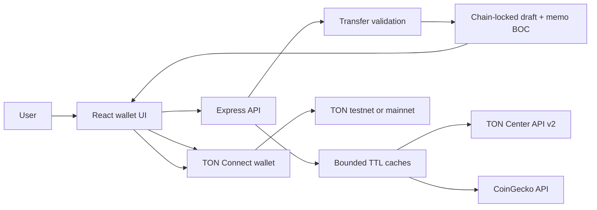

<p align="center">
  
</p>

<h1 align="center">VORIX Wallet Beta</h1>

<p align="center">
  <strong>A testnet-first TON dashboard for live balances, market context, and wallet-signed transfers.</strong>
</p>

<p align="center">
  <a href="https://github.com/cyber-debug/ton-token-app/actions/workflows/ci.yml"></a>
  <a href="https://github.com/cyber-debug/ton-token-app/actions/workflows/deploy-pages.yml"></a>
  
  
  
  
</p>

<p align="center">
  <a href="#features">Features</a> ·
  <a href="#architecture">Architecture</a> ·
  <a href="#quick-start">Quick Start</a> ·
  <a href="#configuration">Configuration</a> ·
  <a href="#github-automation">GitHub</a> ·
  <a href="#security">Security</a>
</p>

VORIX is a live-data TON wallet beta with a React/Vite frontend and an Express
API. It connects to user-controlled wallets through TON Connect, reads balances
from TON Center, displays market data from CoinGecko, and prepares validated TON
transfers without handling seed phrases or private keys.

The frontend and backend share an explicit chain contract. Testnet is the safe
default; a transfer is blocked whenever the configured frontend, backend, or
connected wallet network differs.

> [!IMPORTANT]
> VORIX is beta software, not an exchange or custody service. Market estimates
> are informational and do not execute swaps or reserve prices. Verify the
> network, recipient, amount, fee, and memo in the wallet confirmation screen
> before approving any transfer.

## Features

- **Wallet-owned signing** — TON Connect keeps keys and transaction approval in
  the connected wallet; VORIX never requests or stores a mnemonic.
- **Chain-locked transfers** — frontend, API, draft, and wallet chain IDs must
  agree before a signing request is created.
- **Exact TON amounts** — decimal strings are converted to nanoTON server-side
  without floating-point transfer arithmetic.
- **Real memo payloads** — optional memos are encoded as standard TON text
  comment cells and included in the wallet transaction.
- **Live account data** — balances come from TON Center API v2 and are tagged
  with their network, source, update time, and stale status.
- **Honest market context** — CoinGecko powers the market snapshot, history,
  and clearly labeled non-executable buy/sell estimates.
- **Resilient upstream access** — bounded request timeouts and short-lived
  caches can serve recently known data during transient provider failures.
- **Private activity** — approved transfer summaries stay in browser storage;
  the API does not maintain a cross-user activity feed.
- **Responsive beta UI** — lazy routes, split vendor bundles, reduced-motion
  support, keyboard focus states, and explicit live/demo/network indicators.

## Architecture



| Component | Responsibility |
| --- | --- |
| React application | Wallet connection, balances, market UI, estimates, transfer review, and local activity |
| API client and hooks | Request timeouts, structured errors, demo fallbacks, and shared dashboard state |
| Express application | Security headers, CORS, rate limits, request IDs, API routes, and SPA serving |
| Market service | CoinGecko snapshots/history, validation, fresh cache, and marked stale fallback |
| Balance service | TON address normalization, TON Center lookup, and network-tagged balance cache |
| Transfer service | Chain agreement, exact amounts, sender/recipient validation, beta cap, and memo encoding |

## Product Boundaries

| Capability | Beta behavior |
| --- | --- |
| Wallet custody | Non-custodial; keys remain in the wallet |
| TON transfers | Real wallet signing after backend validation |
| Transfer confirmation | “Approved in wallet” only; finality should be checked in a TON explorer |
| Market estimates | Informational only; no swap execution or price reservation |
| Activity history | Browser-local convenience history, not an authoritative ledger |
| Telegram profile | Display-only `initDataUnsafe`; never treated as authenticated identity |
| Demo mode | Clearly labeled synthetic data with transfers disabled |

## Quick Start

### Requirements

- Node.js 20.19+, 22.13+, or 24+; Node.js 22 is used in CI
- npm 10
- A TON Connect-compatible wallet for interactive transfer testing

Install the locked dependency graph and run the complete repository checks:

```bash
git clone https://github.com/cyber-debug/ton-token-app.git
cd ton-token-app
npm ci
npm run check
```

Create local development configuration and start both surfaces:

```bash
cp .env.example .env
npm start
```

| Surface | Local URL |
| --- | --- |
| Vite frontend | `http://127.0.0.1:4173` |
| Express API | `http://127.0.0.1:4174` |

The project intentionally avoids the common 3000/3001 pair. Override
`DEV_FRONTEND_PORT` and `BACKEND_PORT` in `.env`; Vite reads the backend port
when configuring its development API proxy.

### Commands

| Command | Purpose |
| --- | --- |
| `npm start` | Run frontend and backend development processes together |
| `npm run client` | Run only the Vite frontend |
| `npm run server` | Run only the Express API |
| `npm run lint` | Run zero-warning ESLint checks |
| `npm test` | Run frontend, transfer-contract, and backend API tests |
| `npm run build` | Create the route-split production frontend in `build/` |
| `npm run check` | Run lint, tests, and production build serially |
| `npm run manifest:generate` | Generate static TonConnect metadata for a public URL |

## Configuration

Copy [`.env.example`](.env.example) to `.env`. Local environment files are
ignored by Git and must never contain committed credentials.

| Variable | Purpose | Default |
| --- | --- | --- |
| `TON_NETWORK` | Backend chain: `testnet` or `mainnet` | `testnet` |
| `VITE_TON_NETWORK` | Frontend chain; must match the backend | `testnet` |
| `TONCENTER_API_KEY` | Optional TON Center key; anonymous access is rate limited | empty |
| `MAX_TRANSFER_TON` | Maximum amount accepted by one beta transfer draft | `100` |
| `APP_PUBLIC_URL` | Canonical app/API URL; required in production | empty |
| `CORS_ORIGIN` | Comma-separated frontend origins allowed by a separate API | empty |
| `VITE_API_BASE_URL` | Public API URL when frontend and backend are separate | same origin |
| `VITE_DEMO_MODE` | Enable labeled synthetic data and disable transfers | `false` |
| `UPSTREAM_TIMEOUT_MS` | Timeout for TON Center and CoinGecko calls | `8000` |
| `TRUST_PROXY_HOPS` | Exact reverse-proxy hop count trusted by Express | `0` |

The API refuses to boot in production without `APP_PUBLIC_URL`. This prevents
forwarded request host data from becoming TonConnect manifest metadata.

### Mainnet Opt-In

Mainnet is never inferred from the connected wallet. Configure both surfaces
explicitly and deploy them together:

```bash
TON_NETWORK=mainnet VITE_TON_NETWORK=mainnet npm start
```

If any chain ID differs, transfer preparation or wallet signing is blocked.

## API

| Method | Endpoint | Purpose |
| --- | --- | --- |
| `GET` | `/api/health` | Release, environment, network, chain, and uptime |
| `GET` | `/api/tonconnect-manifest` | Canonical runtime TonConnect metadata |
| `GET` | `/api/dashboard` | Market and backend status snapshot |
| `GET` | `/api/market/ton` | Live TON market snapshot |
| `GET` | `/api/market/ton/history?days=1` | One to thirty days of market history |
| `GET` | `/api/quotes/preview?side=buy&amount=10` | Non-executable market estimate |
| `GET` | `/api/balance/:address` | Network-tagged TON balance |
| `POST` | `/api/transfer/prepare` | Validate and prepare a wallet signing draft |
| `GET` | `/api/activity` | Privacy-safe empty server activity contract |

Responses include an `X-Request-Id` header and `requestId` body field.
Validation errors use HTTP 400, rate limits use 429, and unavailable upstream
providers use 502.

## Repository Layout

```text
.
├── public/                       # Logo, robots policy, and static TonConnect manifest
├── scripts/                      # Deployment manifest generation
├── server/
│   ├── app.js                    # Express composition, middleware, routes, and SPA serving
│   ├── config.js                 # Strict environment parsing and network defaults
│   ├── index.js                  # Process startup and graceful shutdown
│   ├── lib/                      # Cache, HTTP errors, and bounded upstream fetch helper
│   └── services/                 # Balance, market, and transfer domain services
├── src/
│   ├── components/               # Wallet, balance, market, transfer, and navigation UI
│   ├── hooks/                    # Dashboard and browser-private activity state
│   ├── lib/                      # API client, offline data, and local activity storage
│   └── pages/                    # Lazy-loaded Home, Market/Send, and Profile routes
├── .github/workflows/            # CI and opt-in live Pages deployment
├── eslint.config.js              # Browser, Node, React, and hooks lint policy
└── vite.config.js                # Development proxy, tests, build, and vendor splitting
```

Generated bundles, coverage, dependency directories, credentials, and local
environment files do not belong in source control.

## Integrations

| Area | Integration |
| --- | --- |
| Wallet connection and signing | TON Connect UI |
| Blockchain balances | TON Center API v2 |
| Market data | CoinGecko API |
| Telegram session display | Telegram Mini App browser object |
| Frontend hosting | Express same-origin serving or GitHub Pages |
| Continuous verification | GitHub Actions and Dependabot |

## Production Deployment

The recommended runtime serves the built SPA and API from one Node process
behind an HTTPS reverse proxy:

```bash
npm ci
npm run build
NODE_ENV=production \
APP_PUBLIC_URL=https://beta.example.com \
BACKEND_HOST=0.0.0.0 \
npm run server
```

Set `TRUST_PROXY_HOPS` to the exact proxy count, configure request buffering at
the edge, and add a TON Center API key before inviting beta traffic. The process
handles `SIGTERM` and `SIGINT` with graceful HTTP shutdown.

## GitHub Automation

- **CI** performs locked installation, zero-warning lint, all frontend/backend
  tests, the production build, and a production dependency audit.
- **GitHub Pages** publishes a labeled demo with transfers disabled until the
  repository variable `VITE_API_BASE_URL` contains a public HTTPS backend URL;
  the same workflow then builds the live frontend automatically.
- **Dependabot** checks npm and GitHub Actions dependencies every week.

GitHub Pages hosts only static frontend assets. Configure the external API with:

```text
APP_PUBLIC_URL=https://your-backend.example
CORS_ORIGIN=https://cyber-debug.github.io
```

Then set these GitHub repository variables:

```text
VITE_API_BASE_URL=https://your-backend.example
VITE_TON_NETWORK=testnet
```

Enable **GitHub Actions** as the Pages publishing source. The workflow uses hash
routing and generates deployment-specific TonConnect manifest metadata.

## Security

- Keep wallet approval in TON Connect and never request seed phrases or private
  keys.
- Keep `TONCENTER_API_KEY` and future provider credentials server-side.
- Use testnet until the complete transfer flow has been reviewed with the
  intended wallet applications.
- Keep `APP_PUBLIC_URL` canonical and HTTPS in production.
- Allow only explicit frontend origins through `CORS_ORIGIN`.
- Keep `TRUST_PROXY_HOPS=0` unless a known reverse proxy is actually present.
- Preserve the default transfer cap or lower it during early beta access.
- Treat browser-local activity as convenience data, not proof of settlement.
- Review dependency and workflow updates before merging Dependabot changes.

## Beta Limitations

- VORIX does not execute token swaps or provide exchange liquidity.
- A successful TON Connect response does not itself prove on-chain finality.
- Activity can be cleared with browser storage and is not synced across devices.
- Market history depends on third-party availability and may be recently cached.
- Production hosting, TLS, monitoring, and alerting remain operator-owned.

## Status

VORIX is currently version `0.2.0-beta.1`. Testnet is the supported default and
mainnet remains an explicit operator opt-in.
